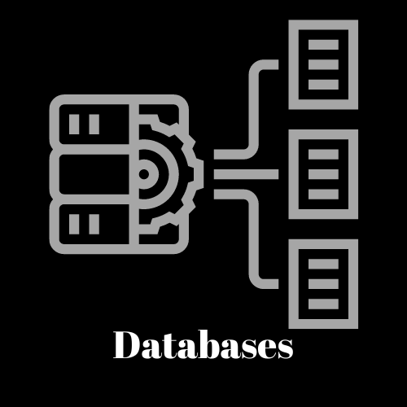

<h1 align="center"> Bonjour🤠, 𝐓𝐚𝐧𝐚𝐲 this side🙎‍♂️</h1>
<h3 align="center">🐳 𝐀𝐧 𝐚𝐬𝐩𝐢𝐫𝐢𝐧𝐠 𝐃𝐚𝐭𝐚 𝐒𝐜𝐢𝐞𝐧𝐭𝐢𝐬𝐭 𝐚𝐧𝐝 𝐚 𝐭𝐞𝐜𝐡 𝐠𝐞𝐞𝐤 𝐰𝐢𝐭𝐡 𝐚 𝐩𝐚𝐬𝐬𝐢𝐨𝐧 𝐟𝐨𝐫 𝐥𝐞𝐚𝐫𝐧𝐢𝐧𝐠 𝐧𝐞𝐰 𝐭𝐞𝐜𝐡𝐧𝐨𝐥𝐨𝐠𝐢𝐞𝐬 🐼</h3>
 

  

- 👨‍💻 𝖨'𝗆 currently 𝗂𝗆𝗆𝖾𝗋𝗌𝗂𝗇𝗀 𝗆𝗒𝗌𝖾𝗅𝖿 𝗂𝗇 𝗍𝗁𝖾 𝗂𝗇𝗍𝗋𝗂𝖼𝖺𝗍𝖾 𝗐𝗈𝗋𝗅𝖽 𝗈𝖿 **𝖣𝖺𝗍𝖺 𝖠𝗇𝖺𝗅𝗒𝗌𝗂𝗌** 𝗍𝖾𝖼𝗁𝗇𝗈𝗅𝗈𝗀𝗂𝖾𝗌.

- 🌐 𝖤𝗑𝗉𝗅𝗈𝗋𝗂𝗇𝗀 𝗍𝗁𝖾 𝗏𝖺𝗌𝗍 𝗅𝖺𝗇𝖽𝗌𝖼𝖺𝗉𝖾 𝗈𝖿 𝗍𝗁𝖾 **𝖣𝖺𝗍𝖺 𝖲𝖼𝗂𝖾𝗇𝗍𝗂𝗌𝗍** 𝖿𝗂𝖾𝗅𝖽 𝗍𝗈 𝗎𝗇𝗋𝖺𝗏𝖾𝗅 𝗂𝗍𝗌 𝗆𝗒𝗌𝗍𝖾𝗋𝗂𝖾𝗌.

- 📱 𝖤𝗇𝗀𝖺𝗀𝖾𝖽 𝗂𝗇 𝗁𝖺𝗇𝖽𝗌-𝗈𝗇 𝗉𝗋𝗈𝗃𝖾𝖼𝗍𝗌, 𝗐𝖾𝖺𝗏𝗂𝗇𝗀 𝗍𝗁𝖾 𝗉𝗈𝗐𝖾𝗋 𝗈𝖿 **𝖯𝗒𝗍𝗁𝗈𝗇** 𝗂𝗇𝗍𝗈 𝗍𝗁𝖾 𝖿𝖺𝖻𝗋𝗂𝖼 𝗈𝖿 **𝖣𝖺𝗍𝖺 𝖠𝗇𝖺𝗅𝗒𝗌𝗂𝗌**.

- 🦜 𝖤𝖺𝗀𝖾𝗋 𝗍𝗈 𝗌𝗉𝗋𝖾𝖺𝖽 𝗆𝗒 𝗐𝗂𝗇𝗀𝗌 𝗂𝗇 𝗍𝗁𝖾 𝗋𝖾𝖺𝗅𝗆 𝗈𝖿 𝖼𝗁𝖺𝗅𝗅𝖾𝗇𝗀𝖾𝗌, 𝖺𝗅𝗐𝖺𝗒𝗌 𝗈𝗉𝖾𝗇 𝗍𝗈 𝗍𝗁𝗋𝗂𝗅𝗅𝗂𝗇𝗀 **𝖧𝖺𝖼𝗄𝖺𝗍𝗁𝗈𝗇𝗌 𝖺𝗇𝖽 𝖯𝗋𝗈𝗃𝖾𝖼𝗍** 𝖼𝗈𝗅𝗅𝖺𝖻𝗈𝗋𝖺𝗍𝗂𝗈𝗇𝗌.

- 📖 𝖠 𝗐𝖺𝗅𝗄𝗂𝗇𝗀 𝖾𝗇𝖼𝗒𝖼𝗅𝗈𝗉𝖾𝖽𝗂𝖺 𝗈𝗇 **𝖠𝗇𝖽𝗋𝗈𝗂𝖽 𝖣𝖾𝗏𝖾𝗅𝗈𝗉𝗆𝖾𝗇𝗍**, 𝖿𝖾𝖾𝗅 𝖿𝗋𝖾𝖾 𝗍𝗈 𝖽𝗂𝗏𝖾 𝗂𝗇𝗍𝗈 𝗆𝗒 𝗄𝗇𝗈𝗐𝗅𝖾𝖽𝗀𝖾 𝗉𝗈𝗈𝗅.

- 😜 𝖥𝗎𝗇 𝖿𝖺𝖼𝗍: 𝖨 𝖿𝗂𝗇𝖽 𝗃𝗈𝗒 𝗂𝗇 𝗐𝖺𝗍𝖼𝗁𝗂𝗇𝗀 **𝖠𝗇𝗂𝗆𝖾** 𝖺𝗇𝖽 𝖼𝖺𝗇 𝖾𝗇𝗀𝖺𝗀𝖾 𝗂𝗇 𝗅𝗂𝗏𝖾𝗅𝗒 **𝖳𝖾𝖼𝗁 𝖣𝗂𝗌𝖼𝗎𝗌𝗌𝗂𝗈𝗇𝗌**!

 

## 📊 GitHub Activity
|  |                                                                                                            |
| --------------------------------------------------------------------------------------------------------------------------------- | ----------------------------------------------------------------------------------------------------------------------------------------------------------------------------------------------------------------- |
|  |  |
|  | 

### 

|               |           |
|       ---     |    ---    |
| |  |
| |         |
| |       |
| |    |
| |    |
| |        |

### 

 

<h2 align="center">🎀 𝙻̷𝚎̷𝚝̷'𝚜̷ 𝙶̷𝚒̷𝚝̷ 𝚒̷𝚝̷ 𝚍̷𝚘̷𝚗̷𝚎̷! 📒</h2>

